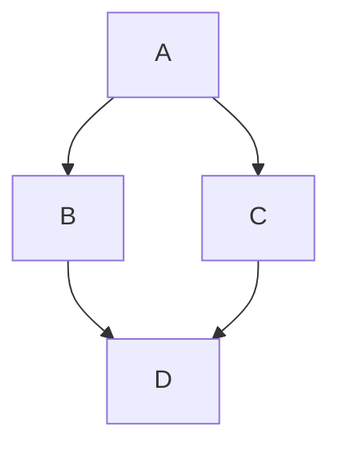

# UI 컴포넌트

Markdown에서 사용할 수 있는 UI 컴포넌트와 CSS 클래스.

---

## 타이포그래피

### 헤딩

```markdown
# H1 헤딩
## H2 헤딩
### H3 헤딩
#### H4 헤딩
##### H5 헤딩
###### H6 헤딩
```

### 텍스트 크기 클래스

헤딩 크기를 임의 요소에 적용:

```markdown
텍스트
{: .text-alpha }   <!-- h1 크기 -->
{: .text-beta }    <!-- h2 크기 -->
{: .text-gamma }   <!-- h3 크기 -->
{: .text-delta }   <!-- h4 크기 -->
{: .text-epsilon } <!-- h5 크기 -->
{: .text-zeta }    <!-- h6 크기 -->
```

### 인라인 서식

```markdown
**볼드** _이탤릭_ ~~취소선~~ [링크](URL) `인라인 코드`
```

---

## 버튼

### 기본 버튼

```markdown
[버튼 텍스트](URL){: .btn }
```

### 색상 변형

```markdown
[Purple](URL){: .btn .btn-purple }
[Blue](URL){: .btn .btn-blue }
[Green](URL){: .btn .btn-green }
[Outline](URL){: .btn .btn-outline }
```

### HTML 버튼

```html
<button type="button" class="btn">Button</button>
```

### 크기 조절

```markdown
<span class="fs-8">
[큰 버튼](URL){: .btn }
</span>

<span class="fs-3">
[작은 버튼](URL){: .btn }
</span>
```

### 버튼 간격

```markdown
[버튼1](URL){: .btn .btn-purple .mr-2 }
[버튼2](URL){: .btn .btn-blue }
```

---

## 라벨

```markdown
Default
{: .label }

Blue
{: .label .label-blue }

Green (Stable)
{: .label .label-green }

Purple (New release)
{: .label .label-purple }

Yellow (Coming soon)
{: .label .label-yellow }

Red (Deprecated)
{: .label .label-red }
```

---

## 테이블

```markdown
| 헤더1 | 헤더2 | 헤더3 |
|:------|:------|:------|
| 셀    | 셀    | 셀    |
```

정렬: `:---` 왼쪽, `:---:` 가운데, `---:` 오른쪽. 테이블은 자동 반응형 (가로 스크롤).

---

## 리스트

### 비순서 목록

```markdown
- 항목 1
- 항목 2
  - 중첩 항목
```

### 순서 목록

```markdown
1. 항목 1
1. 항목 2
1. 항목 3
```

### 태스크 목록

```markdown
- [ ] 미완료 항목
- [x] 완료 항목
```

### 정의 목록

```html
<dl>
  <dt>용어</dt>
  <dd>정의 설명</dd>
</dl>
```

---

## 콜아웃

`_config.yml`에 콜아웃이 정의되어 있어야 사용 가능.

### 제목 없는 콜아웃

```markdown
{: .highlight }
강조할 내용
```

### 기본 콜아웃 (제목 자동 표시)

```markdown
{: .note }
참고 내용

{: .warning }
경고 내용

{: .important }
중요 내용

{: .new }
새로운 기능

{: .highlight }
강조 내용
```

### 커스텀 제목 콜아웃

```markdown
{: .note-title }
> 나만의 제목
>
> 내용 문단
```

### 여러 문단 콜아웃

```markdown
{: .important }
> 첫 번째 문단
>
> 두 번째 문단
>
> 마지막 문단
```

### 여러 문단 + 커스텀 제목

```markdown
{: .important-title }
> 나만의 제목
>
> 첫 번째 문단
>
> 두 번째 문단
```

### 중첩 콜아웃

```markdown
{: .important }
> {: .warning }
> 경고 내용
```

### 불투명 배경 중첩

```markdown
{: .important }
> {: .opaque }
> <div markdown="block">
> {: .warning }
> 내용
> </div>
```

### 블록쿼트 내 콜아웃

```markdown
> {: .highlight }
  강조 내용
```

---

## 코드

### 인라인 코드

```markdown
문장 안에 `코드` 삽입
```

### 구문 강조 코드 블록

````markdown
```java
public class Hello {
    public static void main(String[] args) {
        System.out.println("Hello");
    }
}
```
````

### 코드 + 렌더 예시

```markdown
<div class="code-example" markdown="1">
[버튼 예시](URL){: .btn }
</div>
```

위에 렌더된 결과가 표시되고, 아래에 코드 블록을 배치.

### Mermaid 다이어그램

`_config.yml`에서 `mermaid` 설정 필요.

````markdown

````

### 라인 번호

`_config.yml`에서 설정:
```yaml
kramdown:
  syntax_highlighter_opts:
    block:
      line_numbers: true
```

**주의**: `compress_html` 활성화 시 라인 번호와 충돌. 사용 시 압축 비활성화 필요:
```yaml
compress_html:
  ignore:
    envs: all
```

특정 코드 블록만 라인 번호 없이 표시 (Liquid 태그):
```liquid

코드 내용

```

---

## 접히는 섹션

```markdown
<details open markdown="block">
  <summary>
    섹션 제목
  </summary>

숨겨진 내용

</details>
```

`open` 속성 제거 시 기본 접힌 상태.

---

## kramdown IAL (Inline Attribute List) 문법

모든 Markdown 요소에 CSS 클래스 적용:

```markdown
텍스트 내용
{: .class-1 .class-2 }
```

적용 가능한 대상: 문단, 헤딩, 링크, 블록쿼트, 리스트 등.
